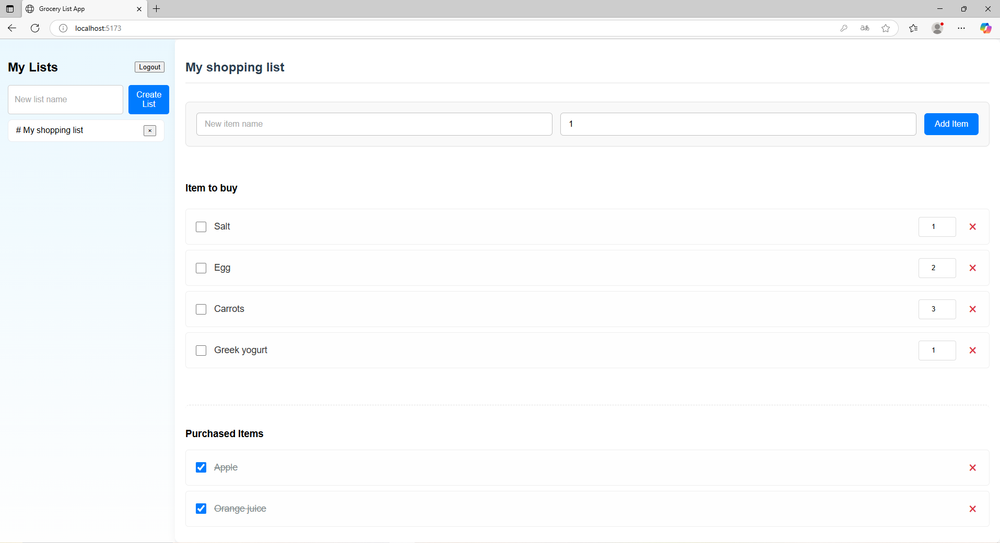
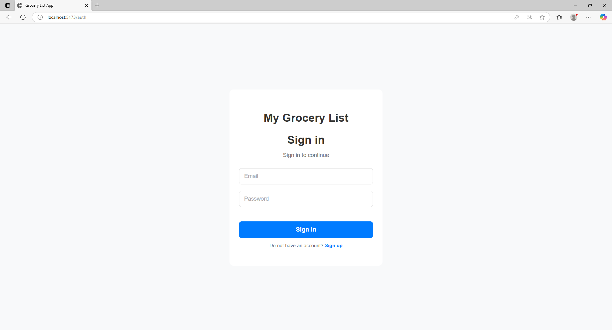

# Grocery List App Overview 

This is a web application designed to help users manage their shopping lists efficiently. The application features a backend for handling CRUD operations and user authentication, and a clear, functional frontend for user interaction.

## Key Features

* User Authentication: The application supports user registration and login
* Multiple Grocery Lists: Users can create and manage multiple grocery lists, visible in a sidebar navigation
* Item Management: Within each list, users can:
    * Add new items (e.g., "Apple Qty: 4", "Fish Qty: 1")
    * Specify quantities for each item.
    * Mark items as purchased or unpurchased using checkboxes. When an item's purchased status changes, it move to a different section.
    * Delete individual items from the list.
* List Operations: The sidebar allows user to:
    * Create a new grocery list by entering a name.
    * Delete existing grocery lists.
    * Select different lists to view their contents
* Logout Function:  A "Logout" button is available in the sidebar header.
* Frontend Structure: The frontend includes dedicated pages for authentication (AuthPage.tsx) and the main application (HomePage.tsx), alongside reusable components like LoginForm.tsx, RegisterForm.tsx, Sidebar.tsx, and GroceryListDetail.tsx.

## Technology Stack:

Backend
- Language: Java
- Fromework: Spring Boot
- Database: PostgreSQL
- Authentication: Spring Security
- Build Tool: Maven

Frontend
- Framework: React.js
- Language: TypeScript
- Build: Vite

## Screenshots

### Main Interface

### Login Page

## Future Enhancements

* User Collaboration: Allow users to share grocery lists with friends or family members, enabling real-time collaborative editing.
* UI/UX Improvements

## License
This project is licensed under the MIT License - see the [LICENSE](LICENSE) file for details.